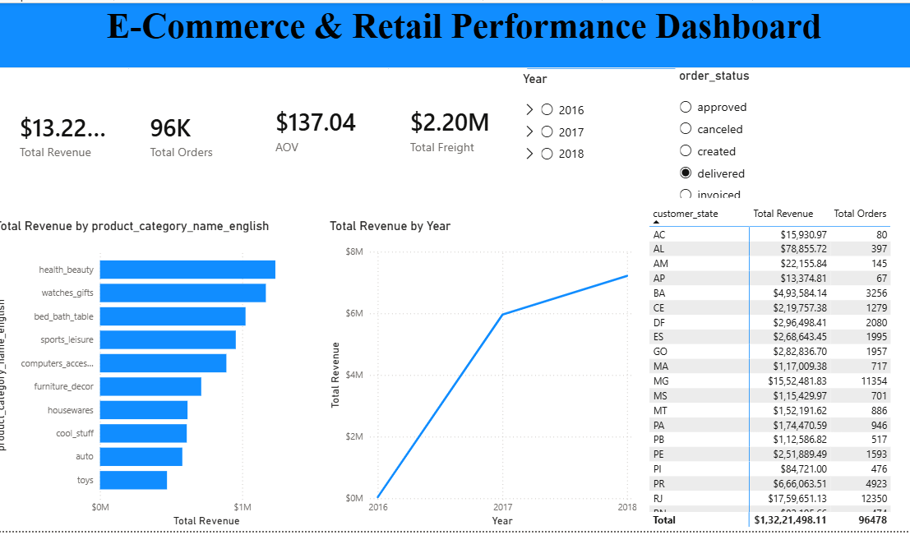

# E-Commerce Data Analytics Project

This project analyzes **99,000+ sales transactions** from the Brazilian e-commerce platform **Olist**. It covers the complete data analytics workflow — from raw data ingestion and cleaning with Python to SQL-based analysis in MySQL and interactive business intelligence dashboards in Power BI.

The project focuses on understanding **sales performance, revenue trends, customer behavior, product categories, and regional performance** through data-driven analysis.

---

## 📌 Project Overview

The goal of this project is to transform raw e-commerce transaction data into meaningful business insights.

The workflow includes:

**Raw Data → Python Data Cleaning → MySQL Database → SQL Analysis → Power BI Dashboard → Business Insights**

The project demonstrates how different tools can be combined into an end-to-end data analytics pipeline.

---

## 🛠️ Tools & Technologies

| Tool                 | Purpose                                  |
| -------------------- | ---------------------------------------- |
| **Python**           | Data ingestion, cleaning, transformation |
| **Pandas**           | Data manipulation and preprocessing      |
| **SQLAlchemy**       | Loading processed data into MySQL        |
| **MySQL**            | Data storage and SQL-based analysis      |
| **MySQL Workbench**  | Running analytical queries               |
| **Power BI**         | Interactive dashboard and visualization  |
| **DAX**              | KPI calculations and business metrics    |
| **Jupyter Notebook** | Data ingestion and ETL workflow          |

---

## 📊 Dataset

The project uses the **Olist Brazilian E-Commerce Dataset**, containing more than **99,000 orders** along with information about customers, products, sellers, payments, reviews, and order delivery.

The dataset contains multiple related tables, including:

* Orders
* Order Items
* Customers
* Products
* Sellers
* Payments
* Reviews
* Product Categories
* Geolocation

---

## 🔄 Data Analytics Pipeline

### 1. Data Ingestion

The raw Olist CSV datasets are loaded into Python using **Pandas**.

The ingestion process handles multiple related datasets and prepares them for further analysis.

### 2. Data Cleaning & Transformation

Python is used to:

* Inspect the datasets
* Handle missing values
* Convert data types
* Convert date columns into appropriate datetime formats
* Clean and standardize the data
* Prepare datasets for database loading
* Create analysis-ready data

### 3. MySQL Database

The cleaned datasets are loaded into **MySQL** using SQLAlchemy.

MySQL is then used as the analytical database for querying the e-commerce data.

### 4. SQL Analysis

SQL queries are used to investigate important business questions such as:

* How is revenue changing over time?
* Which product categories generate the most revenue?
* Which regions have the highest sales?
* What is the average order value?
* How many orders are delivered successfully?
* Which categories contribute most to overall revenue?
* How does sales performance vary across regions?

### 5. Power BI Dashboard

The analyzed data is visualized using **Power BI**.

The dashboard provides an interactive view of:

* Revenue
* Orders
* Average Order Value
* Product category performance
* Regional sales
* Sales trends
* Overall e-commerce performance

---

## 💡 Key Business Insights

The analysis produced several important findings:

* **$13.22M+** in delivered sales revenue was generated across **96K+ delivered orders**.
* The **Average Order Value (AOV)** was approximately **$136.68**.
* **Health & Beauty**, **Watches & Gifts**, and **Bed, Bath & Table** were among the strongest-performing product categories.
* These top categories together contributed **more than 30% of total revenue**.
* **São Paulo (SP)** was the strongest region in terms of order volume and sales.
* The analysis highlights how product category and geographic location influence overall e-commerce performance.

---

## 📸 Dashboard Preview

Add your Power BI dashboard screenshot here:

```markdown

```

> Replace the image path above with the exact location of your dashboard screenshot if the filename is different.

---

## 📁 Project Structure

```text
ecommerce-analytics-pipeline/
│
├── 📂 dashboard/
│   └── Power BI dashboard files and dashboard assets
│
├── 📂 data/
│   └── Dataset files used for the analysis
│
├── 📂 scripts/
│   └── SQL and supporting analysis scripts
│
├── 📓 01_data_ingestion.ipynb.ipynb
│   └── Python data ingestion and cleaning workflow
│
└── 📄 README.md
    └── Project documentation
```

---

## 🚀 How to Run the Project

### Prerequisites

Make sure you have the following installed:

* Python 3.x
* Jupyter Notebook
* MySQL Server
* MySQL Workbench
* Power BI Desktop

### Step 1 — Clone the Repository

```bash
git clone https://github.com/gopsthv/ecommerce-analytics-pipeline.git

cd ecommerce-analytics-pipeline
```

### Step 2 — Install Python Dependencies

Install the required Python libraries:

```bash
pip install pandas sqlalchemy pymysql jupyter
```

### Step 3 — Run the Data Ingestion Notebook

Open the Jupyter notebook:

```bash
jupyter notebook
```

Then open:

```text
01_data_ingestion.ipynb.ipynb
```

Update the MySQL connection details in the notebook and run the cells to clean the data and load it into MySQL.

### Step 4 — Run SQL Analysis

Open the SQL scripts in **MySQL Workbench** and execute the analytical queries.

The queries can be used to explore:

* Revenue trends
* Category performance
* Regional sales
* Order metrics
* Average order value
* Business performance

### Step 5 — Open the Power BI Dashboard

Open the Power BI file from the `dashboard` folder using **Power BI Desktop**.

Refresh the data connection if required and interact with the dashboard using the available filters and visualizations.

---

## 🎯 Business Questions Answered

This project was designed to answer practical e-commerce business questions:

### Sales Performance

* How much revenue has the business generated?
* How does revenue change over time?
* What is the average value of an order?

### Product Performance

* Which product categories generate the most revenue?
* Which categories contribute the largest share of sales?
* How is product performance distributed across the marketplace?

### Regional Performance

* Which Brazilian states generate the most orders?
* Which regions contribute the most revenue?
* Are there noticeable differences in regional sales performance?

### Order Performance

* How many orders were successfully delivered?
* What proportion of orders contribute to delivered revenue?
* How does order volume relate to overall revenue?

---

## 📈 Key KPIs

The Power BI dashboard focuses on important e-commerce KPIs such as:

* **Total Revenue**
* **Total Orders**
* **Delivered Orders**
* **Average Order Value**
* **Revenue by Category**
* **Orders by Region**
* **Monthly Revenue**
* **Category Revenue Contribution**

---

## 🧠 Skills Demonstrated

This project demonstrates practical experience in:

* **Data Cleaning**
* **Data Transformation**
* **Exploratory Data Analysis**
* **Python & Pandas**
* **SQL**
* **MySQL**
* **Database Management**
* **Data Visualization**
* **Power BI**
* **DAX**
* **Business Intelligence**
* **Business Analysis**
* **End-to-End Analytics Workflow**

---

## 🔗 Project Repository

**GitHub:**
https://github.com/gopsthv/ecommerce-analytics-pipeline

---

## 👤 Author

**Gopikadevi**

B.Tech Artificial Intelligence & Data Science

GitHub:
https://github.com/gopsthv

---

## ⭐ Project Summary

This project demonstrates an end-to-end **e-commerce data analytics workflow**, transforming raw transactional data into a structured database, performing SQL-based business analysis, and presenting the results through an interactive Power BI dashboard.

It showcases how **Python, SQL, MySQL, and Power BI** can work together to turn raw data into actionable business insights.
